# Звіт про виконання практичних робіт
## Тема: Дослідження вразливостей OWASP Top 10 (Broken Access Control & Authentication Bypasses)

<div align="center">

-red?style=for-the-badge&logo=owasp)


</div>

---

### 📋 Інформація про студента
* **Студент:** Олег Свириденко
* **Група:** UA-4793-CyberSecurity
* **Дисципліна:** Практикум з кібербезпеки / Безпека веб-застосунків
* **Виконані завдання:**
  1. **Базове завдання:** A01:2021 Broken Access Control — *Hijack a session* (CWE-384 / CWE-330)
  2. **Додаткове завдання (на вибір):** A07:2021 Identification and Authentication Failures — *Authentication Bypasses / 2FA Password Reset* (CWE-287 / CWE-304)

---

## 📑 Зміст звіту
1. [Частина I. Базове завдання: A01 Broken Access Control (Hijack a Session)](#частина-i-базове-завдання-a01-broken-access-control-hijack-a-session)
   - [1.1. Мета та цілі дослідження](#11-мета-та-цілі-дослідження)
   - [1.2. Лабораторне середовище](#12-лабораторне-середовище)
   - [1.3. Теоретичні відомості та концепція атаки](#13-теоретичні-відомості-та-концепція-атаки)
   - [1.4. Покроковий хід виконання роботи](#14-покроковий-хід-виконання-роботи)
   - [1.5. Висновки та рекомендації щодо захисту](#15-висновки-та-рекомендації-щодо-захисту)
2. [Частина II. Додаткове завдання: A07 Identification and Authentication Failures (Authentication Bypasses)](#частина-ii-додаткове-завдання-a07-identification-and-authentication-failures-authentication-bypasses)
   - [2.1. Мета та цілі дослідження](#21-мета-та-цілі-дослідження)
   - [2.2. Теоретичні відомості: логічні вразливості та обхід 2FA](#22-теоретичні-відомості-логічні-вразливості-та-обхід-2fa)
   - [2.3. Покроковий хід виконання роботи](#23-покроковий-хід-виконання-роботи)
   - [2.4. Висновки та рекомендації щодо захисту](#24-висновки-та-рекомендації-щодо-захисту)

---

# Частина I. Базове завдання: A01 Broken Access Control (Hijack a Session)

## 1.1. Мета та цілі дослідження

* **Мета:** Практичне освоєння методів виявлення та експлуатації вразливостей ненадійного контролю доступу (**Broken Access Control**) та слабкого керування сесіями (**Session Management**).
* **Головні завдання:**
  - Провести аналіз формування сесійних ідентифікаторів (`hijack_cookie`) у веб-застосунку **OWASP WebGoat**.
  - Дослідити ступінь ентропії (передбачуваності) токенів сесії.
  - Здійснити атаку типу **Session Hijacking / Session Prediction** шляхом перебору та підбору валідного ідентифікатора паралельної активної сесії автентифікованого користувача.
  - Отримати несанкціонований доступ до чужого облікового запису та сформулювати рекомендації щодо безпечної розробки.

---

## 1.2. Лабораторне середовище

| Компонент / Інструмент | Призначення |
| :--- | :--- |
| **Kali Linux** | Основна операційна система для проведення тестування на проникнення |
| **Docker Engine** | Контейнеризація та локальний запуск тренувального стенду WebGoat |
| **OWASP WebGoat** | Навчальний вразливий веб-застосунок (порт `127.0.0.1:8080`) |
| **Burp Suite Community Edition** | Перехоплюючий HTTP/HTTPS проксі, модулі **HTTP History**, **Repeater**, **Intruder** |
| **Mousepad / Текстовий редактор** | Статистичний аналіз та зіставлення вибірки перехоплених токенів |

---

## 1.3. Теоретичні відомості та концепція атаки

> [!IMPORTANT]
> **Session Hijacking (Захоплення сесії)** — це несанкціоноване перехоплення або підробка валідного сесійного ідентифікатора легітимного користувача з метою отримання доступу до його облікового запису без проходження процедури автентифікації (введення логіна та пароля).

Коли веб-розробники намагаються реалізувати власний механізм генерації ідентифікаторів сесій (Session IDs) замість використання захищених стандартів фреймворку, вони часто припускаються критичної помилки: **недостатньої ентропії та передбачуваності**.

Якщо сесійний ідентифікатор містить послідовні лічильники (Sequential IDs) або відкриті часові мітки (Timestamps), зловмисник може:
1. Отримати кілька власних токенів сесії.
2. Проаналізувати різницю між ними та виявити математичну закономірність.
3. Передбачити значення сесійного ідентифікатора іншого користувача, який авторизувався в системі у цей же проміжок часу.
4. Підставити передбачений токен і підробити чужу сесію.

---

## 1.4. Покроковий хід виконання роботи

### Крок 1. Ознайомлення із завданням у WebGoat

1. Запускаємо контейнер WebGoat та переходимо у браузері за адресою:  
   `http://127.0.0.1:8080/WebGoat/start.mvc?username=student#lesson/HijackSession.lesson`
2. У лівому навігаційному меню обираємо розділ **(A1) Broken Access Control** ➡️ **Hijack a session**.
3. Ознайомлюємося з концепцією уроку та поставленими цілями на вкладці 1.

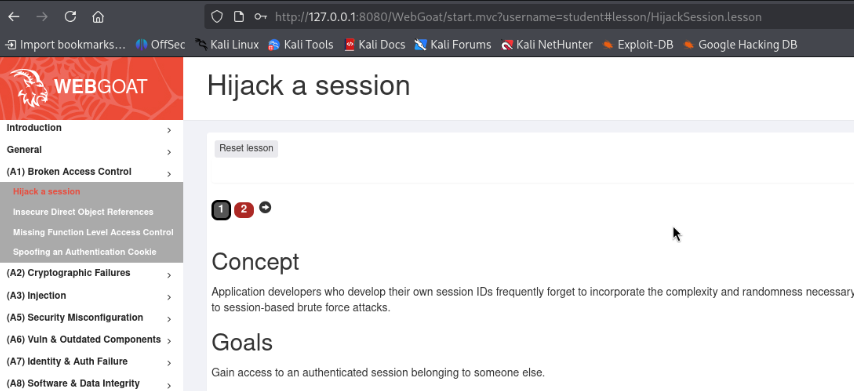

---

### Крок 2. Перехоплення запитів через Burp Suite Proxy

1. Запускаємо **Burp Suite** та перевіряємо активність вбудованого або налаштованого браузера з проксі.
2. Авторизуємося в системі та переходимо до виконання інтерактивної частини на вкладці 2 уроку (підсвічена червоним кольором як незавершена).
3. На сторінці форми вводимо облікові дані користувача (`student`) та натискаємо кнопку **Access**.
4. Відкриваємо вкладку **Proxy** ➡️ **HTTP history** у Burp Suite, щоб знайти надісланий HTTP-запит.

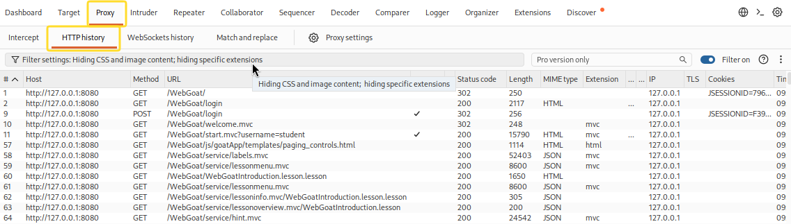

5. Знаходимо запит методом **POST** на ендпоінт `/WebGoat/HijackSession/login` (запит #249).  
   У відповіді сервера спостерігаємо встановлення спеціального сесійного файлу cookie:
   ```http
   Set-Cookie: hijack_cookie=1646056830445989842-1786952707691; Path=/WebGoat; Secure
   ```
   Тіло відповіді містить JSON про невдалу спробу: `{"lessonCompleted":false, "feedback":"Sorry the solution is not correct, please try again."}`.

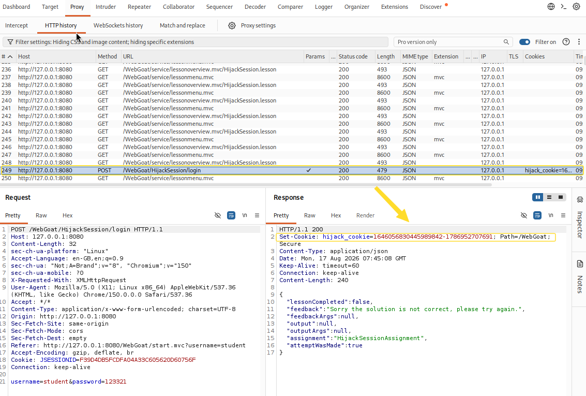

---

### Крок 3. Збір та аналіз зразків сесійних кукі у Repeater

1. Натискаємо правою кнопкою миші на запиті `POST /WebGoat/HijackSession/login` та відправляємо його в модуль **Repeater** (`Ctrl + R`).
2. У вкладці **Repeater** послідовно надсилаємо серію запитів (наприклад, 10–12 запитів поспіль) кнопкою **Send**, фіксуючи кожне нове значення `hijack_cookie`, яке повертає сервер.

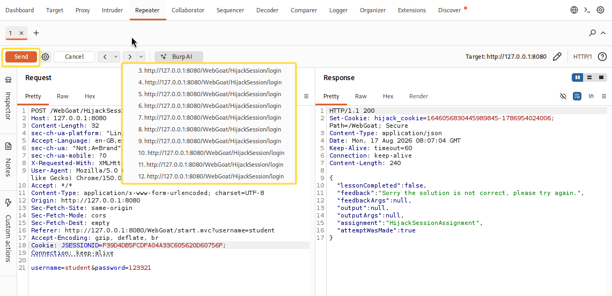

3. Копіюємо отримані значення `hijack_cookie` до текстового редактора (Mousepad) для систематизації.

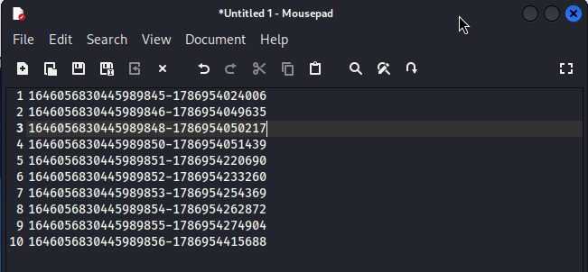

---

### Крок 4. Виявлення алгоритму генерації та прогнозування токена

Зібрана вибірка згенерованих сесійних кукі:

```text
1.  1646056830445989845-1786954024006
2.  1646056830445989846-1786954049635
3.  1646056830445989848-1786954050217
4.  1646056830445989850-1786954051439
5.  1646056830445989851-1786954220690
6.  1646056830445989852-1786954233260
7.  1646056830445989853-1786954254369
8.  1646056830445989854-1786954262872
9.  1646056830445989855-1786954274904
10. 1646056830445989856-1786954415688
```

#### 🔍 Результати аналізу структури кукі:
Кожен токен має формат: `<Sequential_ID>-<Timestamp_ms>`

1. **Перша частина (`Sequential_ID`):**
   - Являє собою звичайний послідовний цілочисельний лічильник.
   - Між записом №2 (`...846`) та №3 (`...848`) пропущено значення **`1646056830445989847`**.
   - Між записом №3 (`...848`) та №4 (`...850`) пропущено значення **`1646056830445989849`**.
   - *Висновок:* Пропущені ідентифікатори належать сесіям інших активних користувачів, створеним у проміжках між нашими кліками.

2. **Друга частина (`Timestamp_ms`):**
   - Це часова мітка у мілісекундах (UNIX Epoch timestamp).
   - Час між сесією `...846` (`1786954049635`) та `...848` (`1786954050217`) становить лише ~582 мілісекунди.
   - Відповідно, шукана сесія `...847` була створена приблизно в момент `17869540496XX`.

---

### Крок 5. Автоматизація підбору токена за допомогою Burp Intruder

1. У **Repeater** обираємо актуальний запит, натискаємо правою кнопкою миші та вибираємо **Send to Intruder** (`Ctrl + I`).

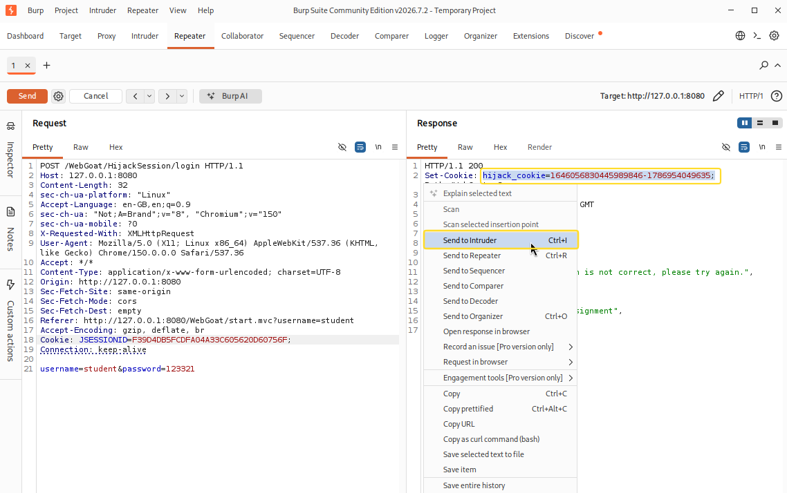

2. У вкладці **Intruder** налаштовуємо параметри атаки:
   - **Attack type:** `Sniper`
   - **Positions:** У заголовку `Cookie` підставляємо базове значення цільової сесії та виділяємо позицію для перебору останніх двох цифр мілісекунд часової мітки:
     ```http
     Cookie: JSESSIONID=F39D4DB5FCDFA04A33C605620D60756F; hijack_cookie=1646056830445989847-17869540496§35§; language=en;
     ```
   - **Payloads:**
     - *Payload type:* `Numbers`
     - *Type:* `Sequential`
     - *From:* `35`, *To:* `99`, *Step:* `1`
     - *Number format:* `Min integer digits = 2`, `Max integer digits = 2`

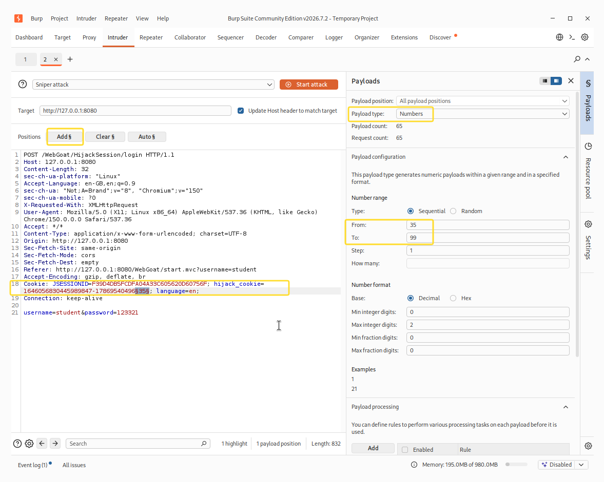

---

### Крок 6. Успішне захоплення сесії та верифікація результату

1. Натискаємо кнопку **Start attack** та відстежуємо результати перебору.
2. Вже на корисній нагрузці `Payload = 35` (що відповідає значенню токена `hijack_cookie=1646056830445989847-1786954049635`) отримуємо відповідь з довжиною **406** байт (на відміну від неуспішних відповідей довжиною **395** байт).
3. Переглядаємо тіло відповіді сервера:
   ```json
   {
     "lessonCompleted": true,
     "feedback": "Congratulations. You have successfully completed the assignment.",
     "feedbackArgs": null,
     "output": null,
     "outputArgs": null,
     "assignment": "HijackSessionAssignment",
     "attemptWasMade": true
   }
   ```

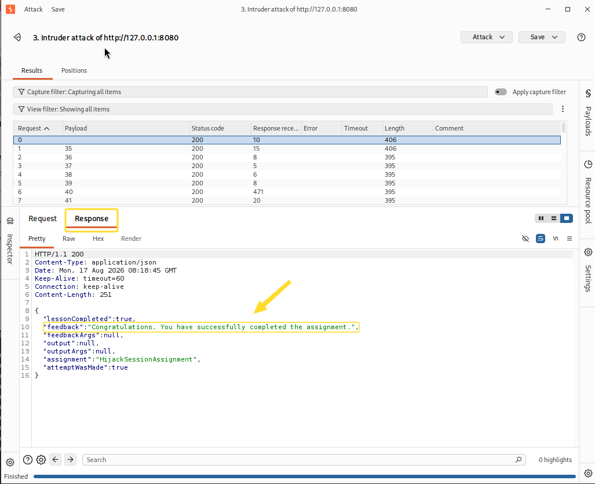

4. Повертаємося до веб-інтерфейсу WebGoat та оновлюємо сторінку.  
   Індикатор кроку №2 стає зеленим, а навпроти завдання **Hijack a session** з'являється зелена галочка успішного проходження.

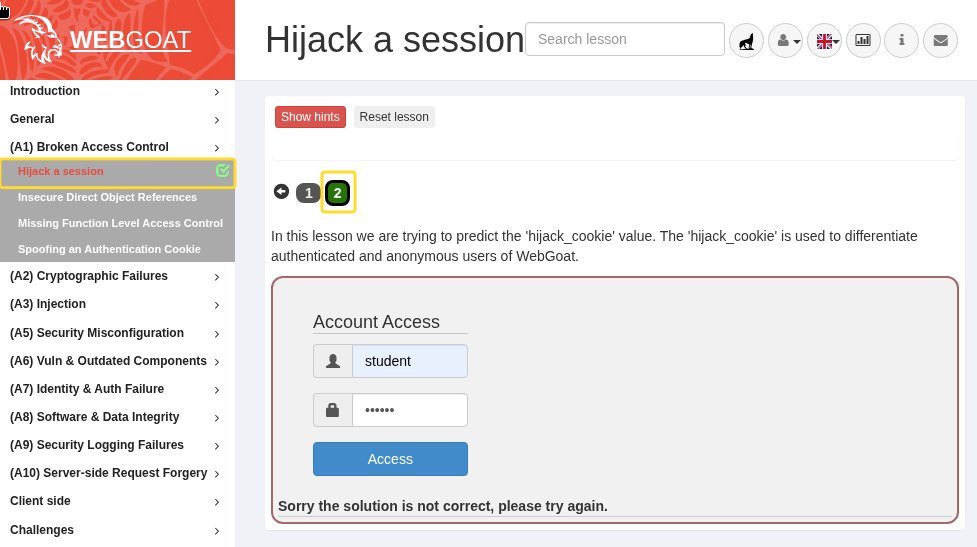

---

## 1.5. Висновки та рекомендації щодо захисту

### 💡 Висновки:
У ході виконання лабораторної роботи було практично продемонстровано реалізацію атаки **Session Hijacking** через слабку генерацію сесійних токенів у веб-застосунку. Відсутність криптографічної випадковості та використання передбачуваних лічильників разом із часовими мітками дає змогу зловмиснику з високою точністю звузити простір перебору та скомпрометувати активну сесію легітимного користувача за лічені секунди.

---

### 🛡️ Рекомендації щодо усунення вразливості (Remediation & Best Practices):

1. **Використання криптографічно стійких генераторів (CSPRNG):**
   - Для генерації сесійних токенів слід використовувати криптографічно надійні генератори випадкових чисел (наприклад, `java.security.SecureRandom`, `crypto.randomBytes()`).
   - Довжина токена повинна становити щонайменше **128 біт** (16 байт) ентропії.

2. **Відмова від кастомних механізмів сесій:**
   - Не створювати власні алгоритми ідентифікації користувачів. Використовувати перевірені механізми сесій веб-фреймворків (Spring Security, ASP.NET Core, Express Session).

3. **Встановлення захисних атрибутів Cookie:**
   - `HttpOnly` — блокує доступ до кукі через JavaScript (захист від XSS-крадіжки токенів).
   - `Secure` — дозволяє передачу кукі виключно через шифроване HTTPS-з'єднання.
   - `SameSite=Strict` або `SameSite=Lax` — захищає від атак міжсайтової підробки запитів (CSRF).

4. **Регенерація та валідація сесій (Session Fixation Protection):**
   - Обов'язкова зміна ідентифікатора сесії після успішної автентифікації користувача.
   - Встановлення тайм-аутів бездіяльності (Idle Timeout) та обмеження абсолютного часу життя сесії.
   - Прив'язка сесії до додаткових контекстних факторів клієнта (IP/Subnet, User-Agent fingerprints) для оперативного виявлення аномальних підключень.

---

# Частина II. Додаткове завдання: A07 Identification and Authentication Failures (Authentication Bypasses)

## 2.1. Мета та цілі дослідження

* **Мета:** Дослідження недоліків бізнес-логіки перевірки автентифікації та механізмів відновлення доступу (**Password Reset / 2FA Verification**) у веб-застосунках.
* **Головні завдання:**
  - Ознайомитися з категорією вразливостей **A07:2021 Identification and Authentication Failures** у WebGoat (урок *Authentication Bypasses*).
  - Дослідити механізм обходу додаткової перевірки особи (2FA / Security Questions) шляхом маніпуляції структурою HTTP POST-запиту (**Parameter Tampering / Parameter Removal**).
  - Відтворити атаку за реальним прецедентом (PayPal 2FA Bypass) та отримати прямий доступ до форми зміни пароля облікового запису без надання правильних відповідей на контрольні запитання.
  - Розробити рекомендації для розробників щодо запобігання логічним помилкам під час валідації багатофакторної автентифікації.

---

## 2.2. Теоретичні відомості: логічні вразливості та обхід 2FA

> [!IMPORTANT]
> **Authentication Bypass (Обхід автентифікації)** — це клас критичних вразливостей, які дозволяють неавторизованому або непідтвердженому користувачу обійти встановлені процедури перевірки особи та отримати привілейований доступ або права на зміну параметрів облікового запису (наприклад, пароля).

У практичній вправі моделюється відомий інцидент безпеки:
Під час відновлення доступу з невідомого пристрою система просить відповісти на 2 контрольні запитання (Knowledge-Based Authentication). 

**У чому полягає критична помилка бізнес-логіки сервера?**
1. Бекенд очікує отримати параметри `secQuestion0` та `secQuestion1`.
2. Якщо ці параметри присутні у запиті — бекенд порівнює передані значення зі збереженими в базі даних.
3. Проте, якщо зловмисник **видаляє** ці параметри з POST-запиту або змінює їхні імена (наприклад, на `secQuestionA`, `secQuestionB`), бекенд отримує значення `null` або ігнорує валідацію через хибну логіку перевірки умовного оператора (fail-open logic) і помилково вважає, що користувач успішно пройшов крок перевірки!

---

## 2.3. Покроковий хід виконання роботи

### Крок 1. Ознайомлення з теоретичною базою уроку

1. У веб-інтерфейсі WebGoat відкриваємо розділ **(A7) Identity & Auth Failure** ➡️ **Authentication Bypasses** за посиланням:  
   `http://127.0.0.1:8080/WebGoat/start.mvc?username=student#lesson/AuthBypass.lesson`
2. На вкладці 1 розглядаємо класичні вектори обходу автентифікації:
   - **Hidden inputs** — покладання розробників на приховані поля у клієнтському DOM.
   - **Removing Parameters** — видалення параметрів із запиту для перевірки реакції бекенду на відсутність обов'язкових полів.
   - **Forced Browsing** — пряме звернення до захищених сторінок в обхід проміжних кроків.

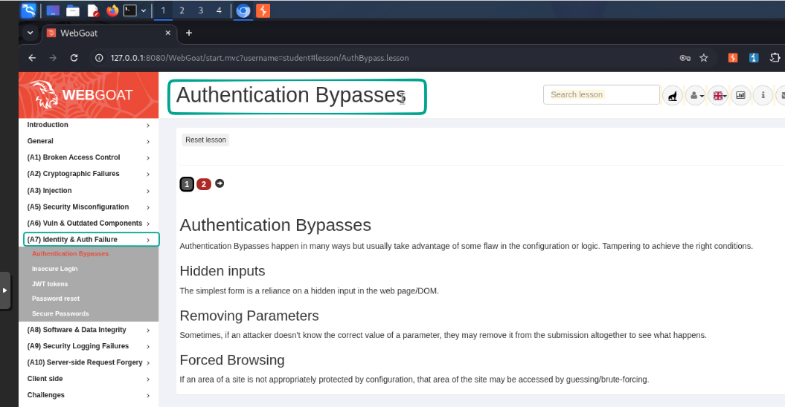

---

### Крок 2. Аналіз сценарію 2FA Password Reset

1. Переходимо на інтерактивну вкладку 2 уроку.
2. Сценарій: користувач відновлює пароль із незнайомого пристрою. Потрібно відповісти на 2 секретні питання:
   - *What is the name of your favorite teacher?*
   - *What is the name of the street you grew up on?*
3. Користувач не знає правильних відповідей. Наша мета — скинути пароль за допомогою підміни параметрів (Parameter Tampering).

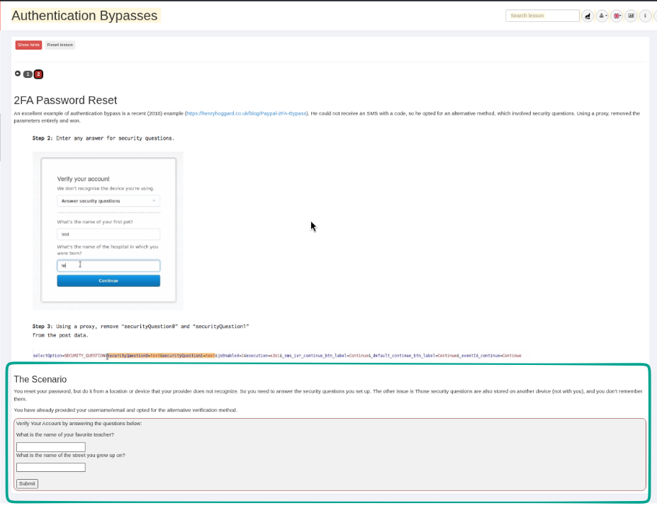

---

### Крок 3. Заповнення форми та підготовка перехоплення запиту

1. Вводимо довільні некоректні значення в обидва поля форми (наприклад, `check` та `check`).

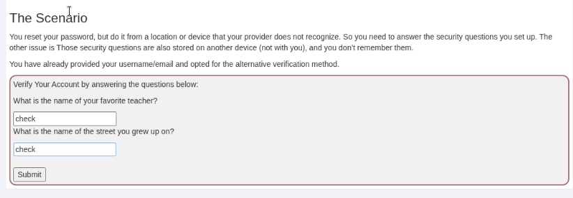

2. У **Burp Suite** переходимо на вкладку **Proxy** ➡️ **Intercept** та активуємо режим перехоплення кнопкою **Intercept is on**.
3. У браузері WebGoat натискаємо кнопку **Submit**.

---

### Крок 4. Перехоплення та маніпуляція HTTP POST-запитом у Burp Intercept

1. У Burp Suite перехоплюється вихідний запит:
   ```http
   POST /WebGoat/auth-bypass/verify-account HTTP/1.1
   Host: 127.0.0.1:8080
   Content-Type: application/x-www-form-urlencoded; charset=UTF-8
   ...

   secQuestion0=check&secQuestion1=check&jsEnabled=1&verifyMethod=SEC_QUESTIONS&userId=12309746
   ```

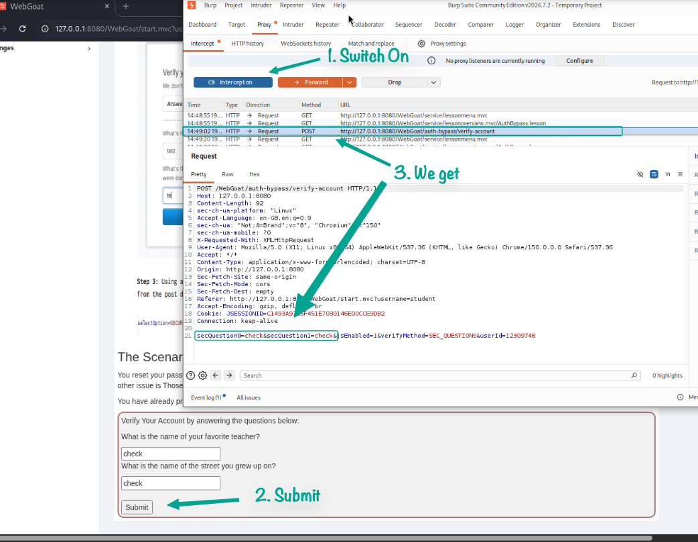

2. **Здійснення атаки Parameter Tampering:**
   - Модифікуємо імена параметрів контрольних питань у тілі запиту:
     - Змінюємо `secQuestion0` ➡️ `secQuestionA`
     - Змінюємо `secQuestion1` ➡️ `secQuestionB`
   - Тіло запиту після модифікації:
     ```http
     secQuestionA=check&secQuestionB=check&jsEnabled=1&verifyMethod=SEC_QUESTIONS&userId=12309746
     ```
   - Натискаємо кнопку **Forward** для відправки зміненого запиту на сервер WebGoat.

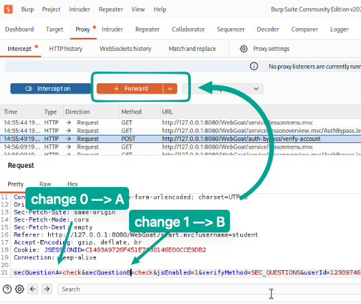

---

### Крок 5. Отримання несанкціонованого доступу до зміни пароля

1. Сервер WebGoat не зміг знайти очікувані параметри `secQuestion0` та `secQuestion1`. Через дефект у бізнес-логіці перевірка завершилася успішно.
2. В інтерфейсі користувача з'являється повідомлення про успішне проходження верифікації та відкривається форма встановлення нового пароля:
   > *"Congrats, you have successfully verified the account without actually verifying it. You can now change your password!"*

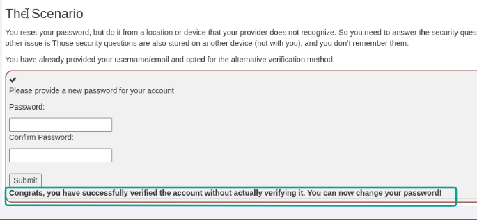

3. Вкладка №2 уроку змінює колір на зелений, а в бічному меню з'являється позначка про успішне виконання завдання.

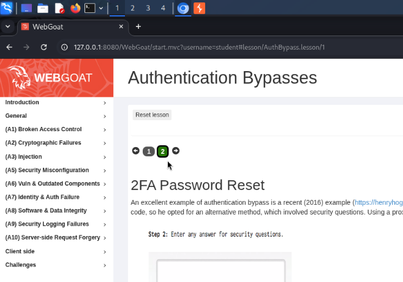

---

## 2.4. Висновки та рекомендації щодо захисту

### 💡 Висновки:
Лабораторна робота демонструє критичність логічних помилок у коді серверних контролерів. Навіть наявність другого фактора автентифікації стає абсолютно неефективною, якщо бекенд не перевіряє обов'язкову наявність усіх вхідних полів та не дотримується концепції «безпечної відмови» (**Fail-Safe Defaults**).

---

### 🛡️ Рекомендації щодо усунення вразливості (Remediation & Best Practices):

1. **Сувора валідація вхідної схеми запиту (Strict Schema Validation):**
   - На рівні бекенду необхідно перевіряти не лише валідність значень параметрів, а й **обов'язкову присутність усіх необхідних ключів** (`secQuestion0`, `secQuestion1`).
   - Якщо будь-який очікуваний параметр відсутній або перейменований, запит повинен негайно відхилятися зі статусом `400 Bad Request`.

2. **Принцип "Fail-Safe Defaults":**
   - Будь-яка функція перевірки автентифікації повинна повертати `false` за замовчуванням.
   - Рішення про надання доступу (`true`) має прийматися виключно тоді, коли всі перевірки пройшли успішно, а не у випадках, коли помилка чи відсутність даних не викликала виключення.

3. **Серверний контроль стану сесії (State Machine / Step Verification):**
   - Процес скидання пароля повинен бути реалізований як кінцевий автомат (State Machine), де перехід до кроку «Введення нового пароля» можливий лише за наявності криптографічно підписаного одноразового токена (Nonce/JWT), виданого після повноцінної перевірки попереднього кроку.

4. **Відмова від небезпечних контрольних питань (KBA):**
   - Механізм контрольних запитань є застарілим і ненадійним. Рекомендується використовувати сучасні протоколи MFA:
     - Одноразові коди за стандартом **TOTP (RFC 6238)** через додатки-автентифікатори (Google Authenticator, Bitwarden).
     - Апаратні ключі або біометрію за стандартами **FIDO2 / WebAuthn**.
     - Підтвердження через захищені канали зв'язку (Push-повідомлення в мобільному додатку з прив'язкою сесії).

---
<div align="center">
  <sub>Звіт підготовлено в рамках навчального курсу з веб-безпеки • 2026</sub>
</div>