# Звіт про виконання практичних робіт
## Тема: Дослідження вразливостей OWASP Top 10 — A03:2021 Injection (SQL Injection & Cross-Site Scripting)

<div align="center">

-red?style=for-the-badge&logo=owasp)


</div>

---

### 📋 Інформація про студента
* **Студент:** Олег Свириденко
* **Група:** UA-4793-CyberSecurity
* **Дисципліна:** Практикум з кібербезпеки / Безпека веб-застосунків
* **Виконані завдання:**
  1. **Основне завдання:** A03:2021 Injection — *SQL Injection (Intro)* (CWE-89)
  2. **Додаткове завдання (на вибір):** A03:2021 Injection — *Cross-Site Scripting (XSS)* (CWE-79)

---

## 📑 Зміст звіту
1. [Частина I. Основне завдання: SQL Injection (Intro)](#частина-i-основне-завдання-sql-injection-intro)
   - [1.1. Мета та цілі дослідження](#11-мета-та-цілі-дослідження)
   - [1.2. Лабораторне середовище](#12-лабораторне-середовище)
   - [1.3. Теоретичні відомості: природа SQLi та тріада CIA](#13-теоретичні-відомості-природа-sqli-та-тріада-cia)
   - [1.4. Покроковий хід виконання роботи](#14-покроковий-хід-виконання-роботи)
     - [Етап 1. Базові операції SQL та вибірка даних](#етап-1-базові-операції-sql-та-вибірка-даних)
     - [Етап 2. Модифікація даних через DML (UPDATE)](#етап-2-модифікація-даних-через-dml-update)
     - [Етап 3. Модифікація схеми через DDL (ALTER TABLE)](#етап-3-модифікація-схеми-через-ddl-alter-table)
     - [Етап 4. Керування привілеями через DCL (GRANT)](#етап-4-керування-привілеями-через-dcl-grant)
     - [Етап 5. Рядкова та числова SQL-ін'єкція (String & Numeric SQLi)](#етап-5-рядкова-та-числова-sql-інєкція-string--numeric-sqli)
     - [Етап 6. Компрометація тріади CIA (Конфіденційність, Цілісність, Доступність)](#етап-6-компрометація-тріади-cia-конфіденційність-цілісність-доступність)
   - [1.5. Висновки та рекомендації щодо захисту від SQL Injection](#15-висновки-та-рекомендації-щодо-захисту-від-sql-injection)
2. [Частина II. Додаткове завдання: Cross-Site Scripting (XSS)](#частина-ii-додаткове-завдання-cross-site-scripting-xss)
   - [2.1. Мета та цілі дослідження](#21-мета-та-цілі-дослідження)
   - [2.2. Теоретичні відомості: класифікація та механізми XSS](#22-теоретичні-відомості-класифікація-та-механізми-xss)
   - [2.3. Покроковий хід виконання роботи](#23-покроковий-хід-виконання-роботи)
     - [Етап 1. Концепція XSS та дослідження Cookie у браузері](#етап-1-концепція-xss-та-дослідження-cookie-у-браузері)
     - [Етап 2. Точки виникнення та вектори загроз](#етап-2-точки-виникнення-та-вектори-загроз)
     - [Етап 3. Експлуатація Reflected XSS (Відбитий XSS)](#етап-3-експлуатація-reflected-xss-відбитий-xss)
     - [Етап 4. Формування шкідливого посилання для відбитої атаки](#етап-4-формування-шкідливого-посилання-для-відбитої-атаки)
     - [Етап 5. Аудит та експлуатація DOM-Based XSS через клієнтський роутер](#етап-5-аудит-та-експлуатація-dom-based-xss-через-клієнтський-роутер)
     - [Етап 6. Підсумкове тестування знань (XSS Quiz)](#етап-6-підсумкове-тестування-знань-xss-quiz)
   - [2.4. Висновки та рекомендації щодо захисту від XSS](#24-висновки-та-рекомендації-щодо-захисту-від-xss)

---

# Частина I. Основне завдання: SQL Injection (Intro)

## 1.1. Мета та цілі дослідження

* **Мета:** Поглиблене вивчення механізмів виникнення, методів виявлення та практичної експлуатації вразливостей впровадження SQL-коду (**SQL Injection**), а також аналіз їхнього деструктивного впливу на безпеку реляційних баз даних.
* **Головні завдання:**
  - Засвоїти фундаментальні категорії SQL-команд: **DML** (маніпулювання), **DDL** (визначення схеми), **DCL** (контроль доступу).
  - Дослідити синтаксичні відмінності та специфіку експлуатації **рядкових (String)** та **числових (Numeric)** SQL-ін'єкцій.
  - Практично відтворити компрометацію всіх трьох складових **тріади CIA**:
    1. *Конфіденційність (Confidentiality)* — несанкціоноване читання чутливих даних (зарплати, TAN-коди, номери кредитних карток).
    2. *Цілісність (Integrity)* — несанкціонована модифікація даних через техніку ланцюжків запитів (**Query Chaining**).
    3. *Доступність (Availability)* — знищення таблиць аудиту та журналів подій (`DROP TABLE`).
  - Сформулювати комплексні рекомендації щодо запобігання SQLi в сучасних веб-додатках.

---

## 1.2. Лабораторне середовище

| Компонент / Інструмент | Призначення |
| :--- | :--- |
| **Kali Linux** | Навчально-дослідницька операційна система |
| **Docker Engine** | Контейнеризоване середовище розгортання вразливих сервісів |
| **OWASP WebGoat v8.x** | Навчальна веб-платформа для тестування веб-вразливостей (`127.0.0.1:8080`) |
| **Вбудований браузер / DevTools** | Інструменти розробника для аналізу DOM, HTTP-запитів, cookies та налагодження JS |

---

## 1.3. Теоретичні відомості: природа SQLi та тріада CIA

> [!IMPORTANT]
> **SQL Injection (SQLi, CWE-89)** — це клас критичних вразливостей впровадження коду, за яких вхідні дані користувача конкатенуються безпосередньо в тіло SQL-запиту без належної фільтрації чи параметризації, дозволяючи зловмиснику змінювати синтаксис та логіку виконання запиту в СУБД.

### Категоризація SQL-команд:
1. **DML (Data Manipulation Language):** `SELECT`, `INSERT`, `UPDATE`, `DELETE` — робота з безпосередніми записами.
2. **DDL (Data Definition Language):** `CREATE`, `ALTER`, `DROP` — зміна та знищення структур (таблиць, стовпців, індексів).
3. **DCL (Data Control Language):** `GRANT`, `REVOKE` — керування правами та привілеями користувачів СУБД.

Вразливість SQLi здатна повністю зруйнувати захист системи на всіх трьох рівнях **CIA**:
* **Confidentiality:** читання закритих даних за допомогою логічних умов `OR '1'='1'`.
* **Integrity:** зміна критичних атрибутів або балансів через `UPDATE` та розділювач `;`.
* **Availability:** блокування або видалення даних/таблиць за допомогою `DROP TABLE` або `TRUNCATE`.

---

## 1.4. Покроковий хід виконання роботи

### Етап 1. Базові операції SQL та вибірка даних

1. Відкриваємо урок **(A3) Injection** ➡️ **SQL Injection (intro)** у WebGoat.
2. Ознайомлюємося з цілями уроку на сторінці 1 та структурою тестової таблиці `employees` на сторінці 2.

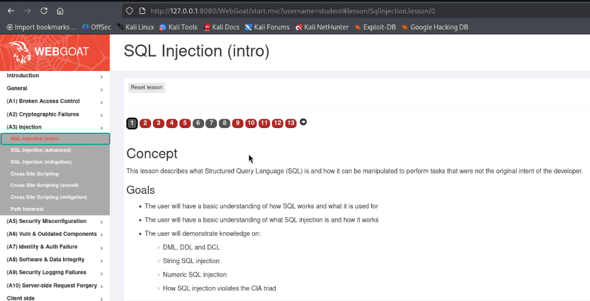
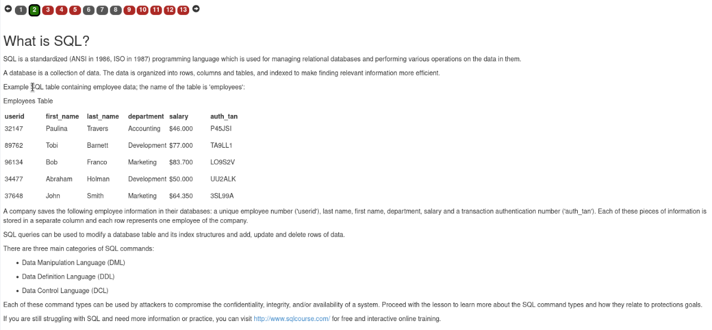

3. **Практичне завдання (Сторінка 2):** Скласти SQL-запит для отримання назви відділу (`department`) співробітника **Bob Franco**.
   - **Запит:**
     ```sql
     SELECT department FROM employees WHERE first_name='Bob' AND last_name='Franco';
     ```
   - **Результат:** Запит успішно виконано, отримано значення `Marketing`.

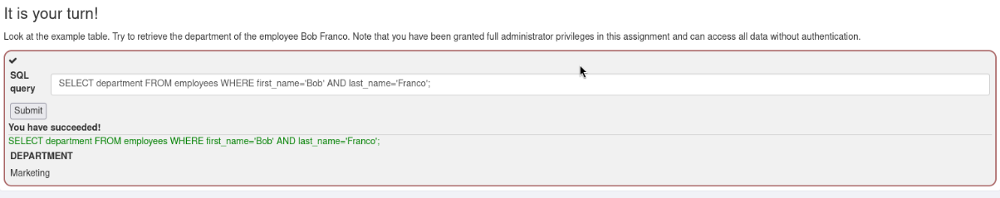

---

### Етап 2. Модифікація даних через DML (UPDATE)

1. На сторінці 3 розглядається мова маніпулювання даними **DML** та її вплив на цілісність системи.

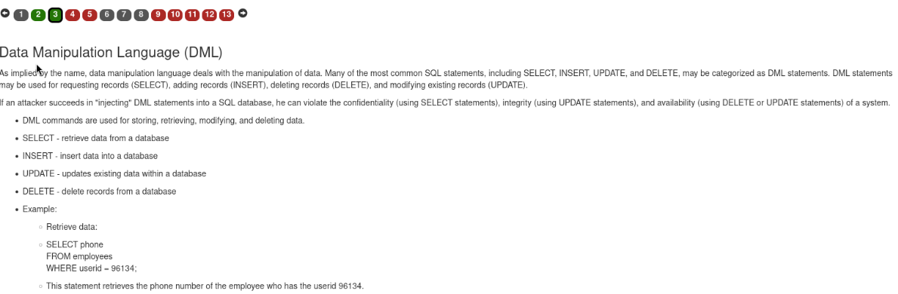

2. **Практичне завдання (Сторінка 3):** Змінити відділ для співробітника **Tobi Barnett** на `'Sales'`.
   - **Запит:**
     ```sql
     UPDATE employees SET department='Sales' WHERE first_name='Tobi' AND last_name='Barnett';
     ```
   - **Результат:** Відділ успішно оновлено, завдання зараховано.

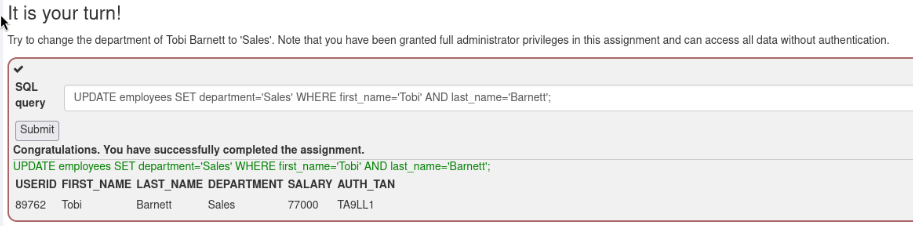

---

### Етап 3. Модифікація схеми через DDL (ALTER TABLE)

1. На сторінці 4 вивчається мова визначення даних **DDL** (`CREATE`, `ALTER`, `DROP`).

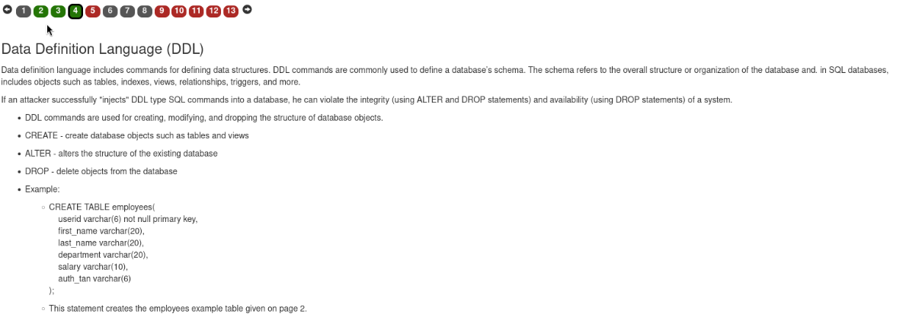

2. **Практичне завдання (Сторінка 4):** Додати стовпець `phone` (тип `varchar(20)`) до таблиці `employees`.
   - **Запит:**
     ```sql
     ALTER TABLE employees ADD phone varchar(20);
     ```
   - **Результат:** Схему таблиці успішно модифіковано.

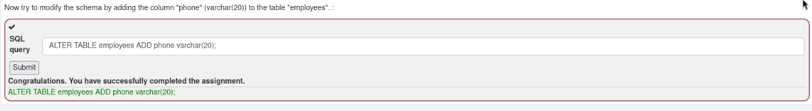

---

### Етап 4. Керування привілеями через DCL (GRANT)

1. На сторінці 5 розглядається мова контролю доступу **DCL** (`GRANT`, `REVOKE`).
2. **Практичне завдання (Сторінка 5):** Надати всі права на таблицю `grant_rights` користувачу `unauthorized_user`.
   - **Запит:**
     ```sql
     GRANT ALL ON grant_rights TO unauthorized_user;
     ```
   - **Результат:** Привілеї успішно делеговано, отримано повідомлення про виконання завдання.

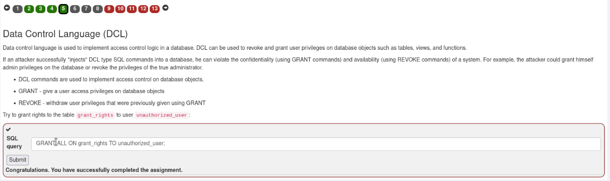

---

### Етап 5. Рядкова та числова SQL-ін'єкція (String & Numeric SQLi)

#### 1. Рядкова ін'єкція (Сторінка 9):
* Вихідний шаблон уразливого коду:
  `"SELECT * FROM user_data WHERE first_name = 'John' AND last_name = '" + lastName + "'";`
* **Пейлоад:** `Smith' or '1' = '1`
* **Сформований запит:** `SELECT * FROM user_data WHERE first_name = 'John' AND last_name = 'Smith' or '1' = '1'`
* **Результат:** Умова `'1'='1'` повертає `TRUE` для кожного рядка, що призводить до повного витоку таблиці `user_data` разом із номерами банківських карток (`CC_NUMBER`).

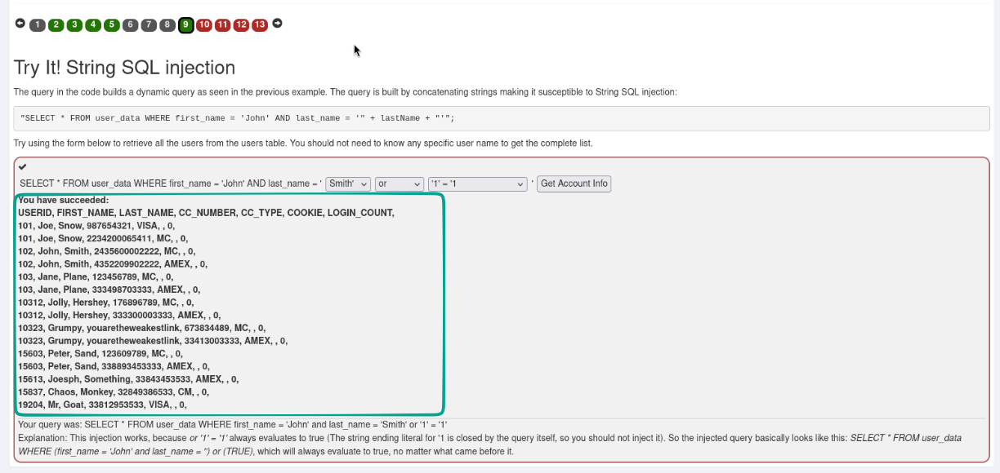

#### 2. Числова ін'єкція (Сторінка 10):
* Вихідний шаблон:
  `"SELECT * FROM user_data WHERE login_count = " + Login_Count + " AND userid = " + User_ID;`
* **Пейлоад:**
  - `Login_Count`: `1`
  - `User_Id`: `1 OR 1 = 1;`
* **Сформований запит:** `SELECT * FROM user_data WHERE login_count = 1 AND userid = 1 OR 1 = 1;`
* **Результат:** На відміну від рядкової ін'єкції, тут відсутні лапки. Додавання `OR 1=1;` нівелює фільтрацію та вивантажує повну базу даних клієнтів.

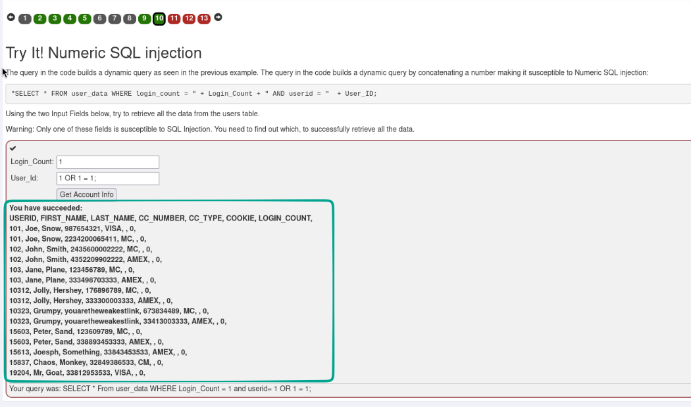

---

### Етап 6. Компрометація тріади CIA (Конфіденційність, Цілісність, Доступність)

#### 1. Порушення Конфіденційності (Сторінка 11):
* Мета: дізнатися зарплати та TAN-коди всіх колег у таблиці `employees`.
* **Пейлоад у поле Employee Name:** `Smith' OR 1 = 1 --`
* **Результат:** Символи коментаря `--` відсікають перевірку поля `auth_tan`, і система повертає повний список співробітників з їхніми фінансовими даними.

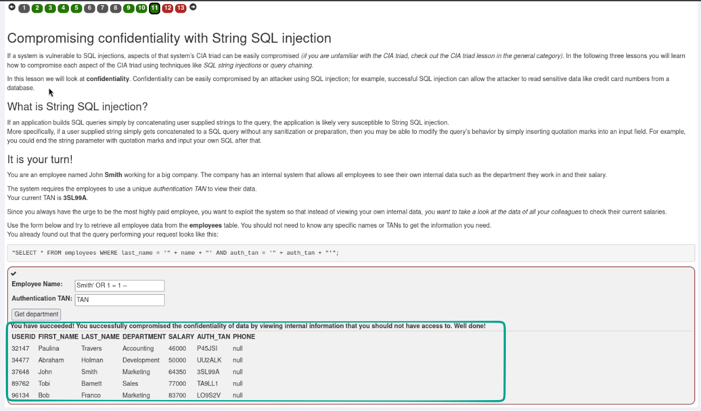

#### 2. Порушення Цілісності через ланцюжки запитів (Query Chaining) (Сторінка 12):
* Мета: змінити власну зарплату (John Smith, `userid = 37648`) на максимальну.
* **Пейлоад:** `000' WHERE userid = 37648;--` або `Smith'; UPDATE employees SET salary = '85000' WHERE userid = 37648;--`
* **Результат:** Розділювач `;` завершує `SELECT`-запит і виконує шкідливий `UPDATE`, що призводить до несанкціонованої зміни балансу на `$85 000`.

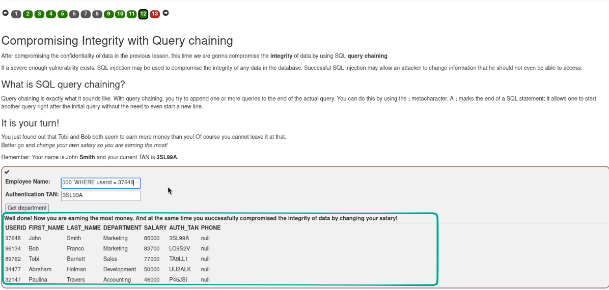

#### 3. Порушення Доступності (Сторінка 13):
* Мета: видалити таблицю системного аудиту `access_log`, щоб приховати сліди несанкціонованих змін.
* **Пейлоад у поле пошуку дій:** `'; DROP TABLE access_log --`
* **Результат:** Таблицю логів повністю видалено з бази даних, що демонструє повне порушення доступності сервісу (Availability). Всі 13 кроків уроку успішно зараховано.

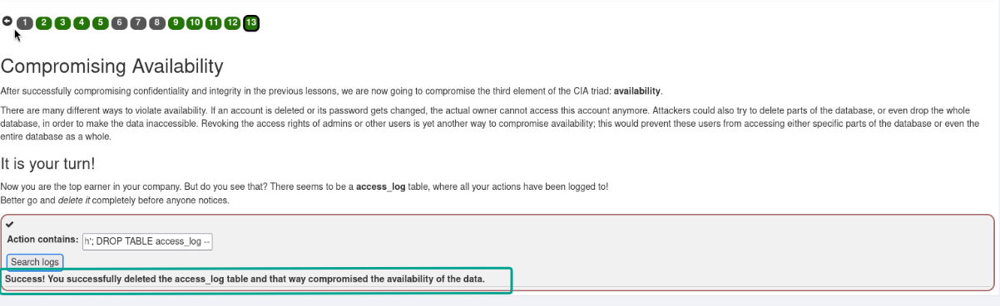

---

## 1.5. Висновки та рекомендації щодо захисту від SQL Injection

### 💡 Висновки:
SQL-ін'єкція залишається однією з найбільш руйнівних вразливостей веб-додатків. Вона надає зловмиснику прямий контроль над базою даних, дозволяючи обходити автентифікацію, масово викрадати конфіденційні записи клієнтів, модифікувати критичні дані та безповоротно знищувати інформацію.

---

### 🛡️ Рекомендації щодо усунення SQLi:

1. **Параметризовані запити (Prepared Statements):**
   - Усі динамічні параметри повинні передаватися як параметризовані змінні (плейсхолдери `?` або іменовані параметри), що повністю розділяє код SQL-команди та призначені для користувача дані.
   ```java
   // Безпечний приклад (Java PreparedStatement):
   String query = "SELECT * FROM employees WHERE last_name = ? AND auth_tan = ?";
   PreparedStatement pstmt = connection.prepareStatement(query);
   pstmt.setString(1, userLastName);
   pstmt.setString(2, userTan);
   ResultSet rs = pstmt.executeQuery();
   ```
2. **Використання безпечних ORM-фреймворків:**
   - Застосування Hibernate, JPA, Entity Framework із вбудованим автоматичним екрануванням та параметризацією.
3. **Принцип найменших привілеїв (Least Privilege):**
   - Обліковий запис СУБД, під яким працює веб-додаток, не повинен мати прав на виконання команд DDL (`DROP`, `ALTER`) або доступ до системних таблиць.
4. **Валідація та типізація вхідних даних (Allow-listing):**
   - Сувора перевірка типів даних (перетворення числових параметрів в `int`/`long` перед формуванням логіки).

---

# Частина II. Додаткове завдання: Cross-Site Scripting (XSS)

## 2.1. Мета та цілі дослідження

* **Мета:** Практичне вивчення природи, механізмів виникнення та методів експлуатації вразливостей міжсайтового скриптингу (**Cross-Site Scripting, XSS**), а також дослідження загроз виконання стороннього JavaScript-коду в контексті браузера жертви.
* **Головні завдання:**
  - Ознайомитися з класифікацією XSS: **Reflected (Відбитий)**, **Stored (Збережений)**, **DOM-Based (Клієнтський)**.
  - Дослідити доступність чутливих сесійних cookies (`document.cookie`, `JSESSIONID`) та перевірити наявність захисних прапорців (`HttpOnly`).
  - Відтворити сценарій **Reflected XSS** через уразливі поля введення та сконструювати шкідливе URL-посилання для віддаленої атаки.
  - Провести аналіз JavaScript-коду клієнтського роутера (`GoatRouter.js`) на базі Backbone.js та реалізувати **DOM-Based XSS** з викликом внутрішньої функції додатка.
  - Закріпити знання проходженням підсумкового тесту (XSS Quiz).

---

## 2.2. Теоретичні відомості: класифікація та механізми XSS

> [!IMPORTANT]
> **Cross-Site Scripting (XSS, CWE-79)** — це клієнтська вразливість впровадження коду, яка виникає, коли веб-додаток включає неперевірені та неекрановані дані користувача у вихідний HTML-код веб-сторінки, що дозволяє виконувати довільний JavaScript у браузері відвідувача.

### Основні типи XSS:
1. **Reflected XSS (Відбитий):** Шкідливий скрипт передається у самому HTTP-запиті (зазвичай у параметрах GET-запиту) і негайно відображається сервером у відповіді. Вимагає взаємодії з жертвою (клік за посиланням).
2. **DOM-Based XSS:** Уразливість виникає виключно на стороні клієнта, коли JavaScript-код обробляє дані з ненадійного джерела (джерело / *Source*, наприклад `location.hash`) і передає їх у небезпечний приймач (приймач / *Sink*, наприклад `eval()`, `innerHTML`, роутер).
3. **Stored XSS (Збережений / Постійний):** Шкідливий код зберігається на сервері (у базі даних, файлі) і автоматично виконується у браузерах усіх користувачів, які переглядають уразливу сторінку.

---

## 2.3. Покроковий хід виконання роботи

### Етап 1. Концепція XSS та дослідження Cookie у браузері

1. Відкриваємо урок **(A3) Injection** ➡️ **Cross Site Scripting** у WebGoat.
2. На сторінці 1 вивчаємо концепцію та цілі модуля.

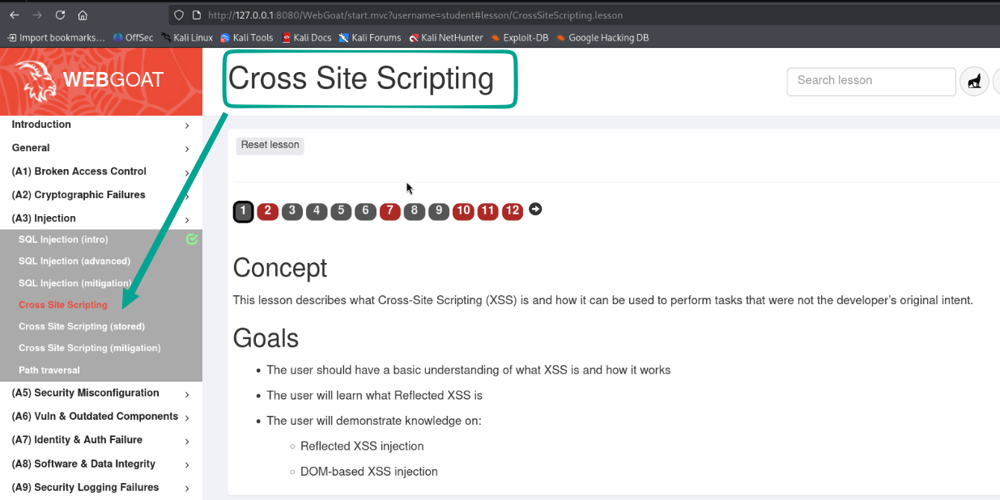

3. **Практика (Сторінка 2):** Перевірка сесійних cookies через консоль розробника.
   - Відкриваємо дві різні вкладки WebGoat та виконуємо команду `alert(document.cookie)`.
   - Фіксуємо, що значення сесії залишається спільним для всіх вкладок у межах одного домену.
   - Підтверджуємо прапорцем `"The cookies are the same on each tab"` і натискаємо **Submit**.

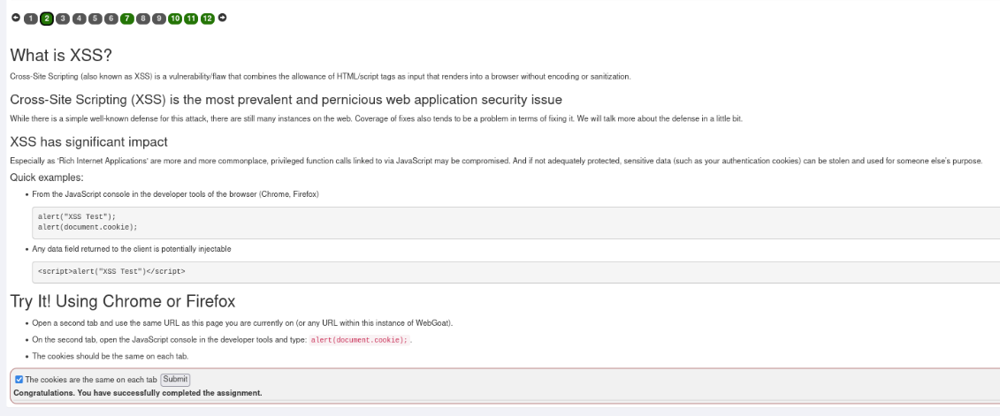

4. **Аналіз Storage у DevTools:**
   - Перевіряємо властивості cookie `JSESSIONID` у вкладці **Storage ➡️ Cookies**:
     - `HttpOnly: true` — захищає cookie від читання через `document.cookie`.
     - `Secure: false`, `SameSite: None`.

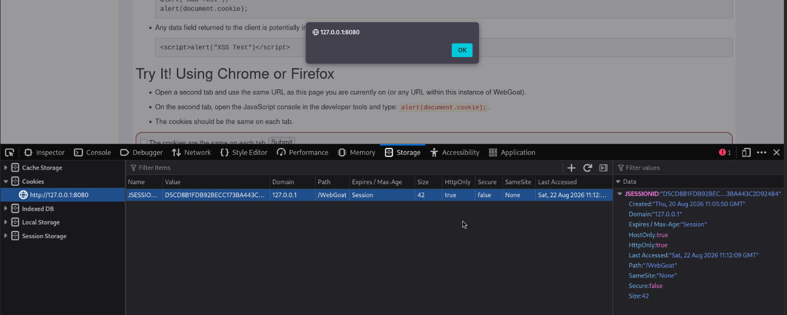

---

### Етап 2. Точки виникнення та вектори загроз

1. На сторінках 3–5 розглядаються найпоширеніші місця виникнення XSS (поля пошуку, форми вводу, повідомлення про помилки, приховані поля, заголовки HTTP).

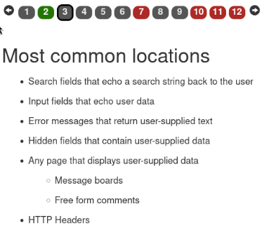

2. Ознайомлюємося з небезпечними наслідками XSS-атак: крадіжка сесійних токенів, виконання дій від імені жертви, фішинг, підміна контенту, перенаправлення на шкідливі сайти.

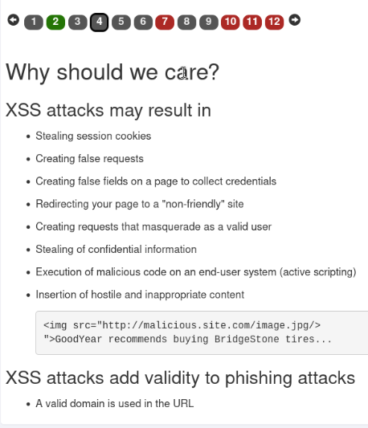

3. Досліджуємо класифікацію XSS та схему взаємодії зловмисника, жертви та сервера при відбитому XSS.

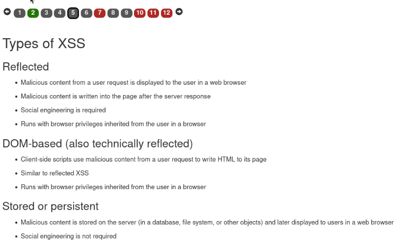
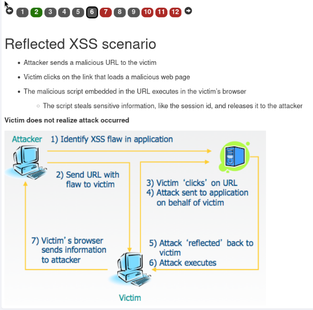

---

### Етап 3. Експлуатація Reflected XSS (Відбитий XSS)

1. **Практичне завдання (Сторінка 7):** Виявити уразливе поле у формі оформлення замовлення інтернет-магазину.
2. Вводимо XSS-пейлоад у поле **Enter your credit card number**:
   ```html
   <script>alert('XSS');</script>
   ```
   Вводимо тризначний код доступу (`111`) та натискаємо кнопку **Purchase**.
3. **Результат:** Браузер виконує впроваджений скрипт і відображає модальне вікно `alert("XSS")`. Вразливість підтверджено.

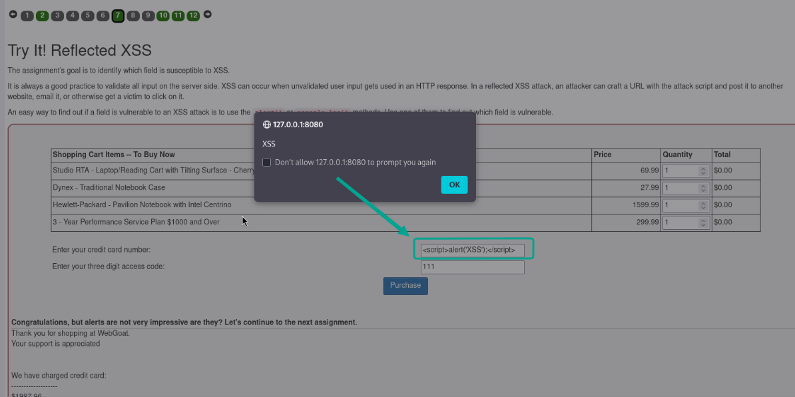

---

### Етап 4. Формування шкідливого посилання для відбитої атаки

1. На сторінці 8 розглядається різниця між Self-XSS та справжнім Reflected XSS, який доставляється через URL-параметри GET-запиту.

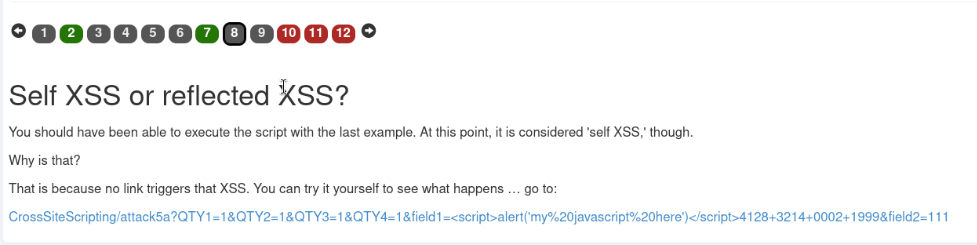

2. **Експлуатація через GET URL:**
   - Формуємо шкідливий запит:
     ```text
     http://127.0.0.1:8080/WebGoat/CrossSiteScripting/attack5a?QTY1=1&QTY2=1&QTY3=1&QTY4=1&field1=<script>alert('my javascript here')</script>4128+3214+0002+1999&field2=111
     ```
   - При переході за цим посиланням сервер WebGoat повертає JSON із підтвердженням виконання: `"lessonCompleted": true`.

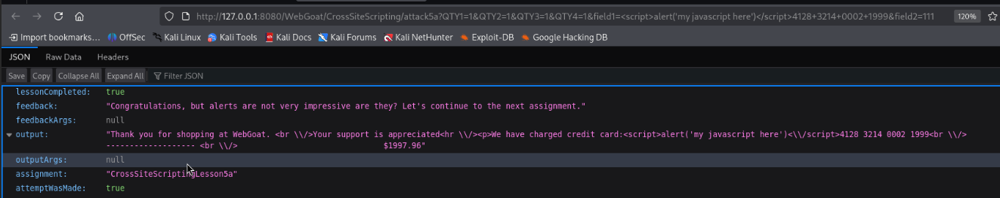

---

### Етап 5. Аудит та експлуатація DOM-Based XSS через клієнтський роутер

1. На сторінці 9–10 аналізується концепція **DOM-Based XSS**, де скрипт виконується повністю у клієнтському середовищі без участі сервера.

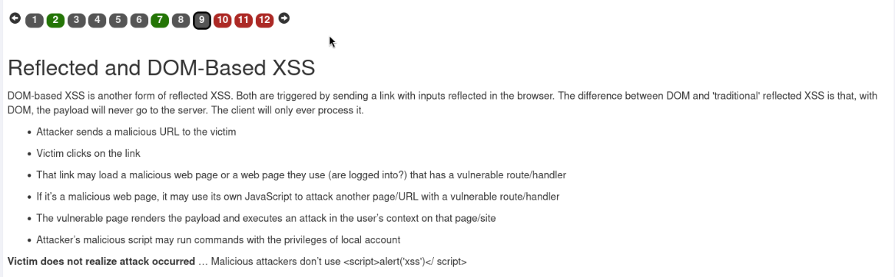

2. **Пошук тестового роута у вихідному коді:**
   - Відкриваємо **DevTools ➡️ Debugger** та досліджуємо клієнтський файл `GoatRouter.js` (Backbone Router).
   - Знаходимо прихований тестовий маршрут:
     ```javascript
     routes: {
         'welcome': 'welcomeRoute',
         'lesson/:name': 'lessonRoute',
         'lesson/:name/:pageNum': 'lessonPageRoute',
         'test/:param': 'testRoute',
         'reportCard': 'reportCard'
     }
     ```
   - Вводимо у поле відповіді: `start.mvc#test/` ➡️ **Correct!**

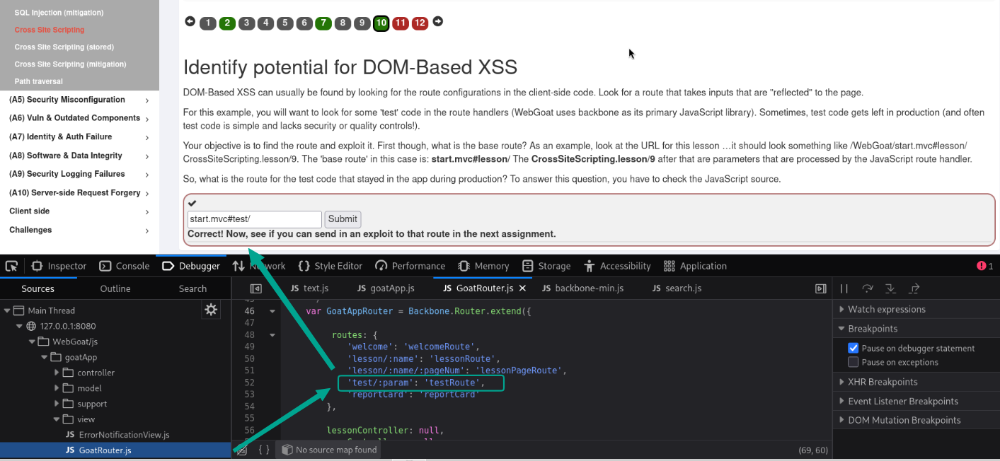

3. **Експлуатація DOM-XSS (Сторінка 11):**
   - Необхідно викликати внутрішню функцію `webgoat.customjs.phoneHome()`.
   - При виклику функція генерує унікальний числовий токен-відповідь:
     `phone home said {"lessonCompleted":true,"output":"phoneHome Response is -444994235"}`
   - Вводимо згенероване число `-444994235` у поле валідації ➡️ Завдання зараховано!

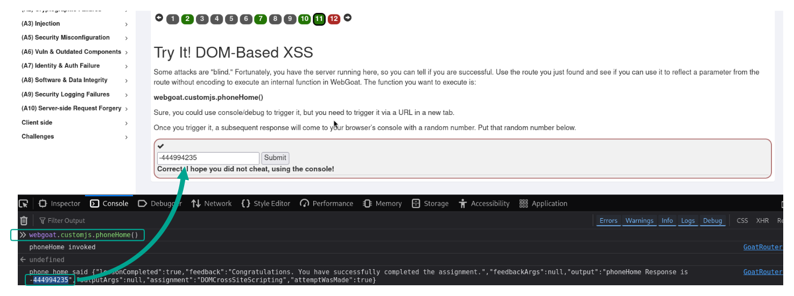

---

### Етап 6. Підсумкове тестування знань (XSS Quiz)

На сторінці 12 виконуємо фінальне тестування з 5 питань щодо механізмів та векторів XSS:
1. *Чи захищені відомі сайти, такі як Netflix, від XSS?*  
   👉 **Ні**, браузер довіряє сайту і виконує будь-який впроваджений скрипт.
2. *Коли виникають XSS-атаки?*  
   👉 **Коли сайт не валідує або не екранує вхідні дані**, що дозволяє виконання скриптів.
3. *Що таке Stored XSS?*  
   👉 **Скрипт постійно зберігається на сервері** і виконується під час завантаження сторінки жертвами.
4. *Що таке Reflected XSS?*  
   👉 **Скрипт відображається від веб-сервера** як частина відповіді на вхідний запит.
5. *Чи є JavaScript єдиним способом виконання XSS?*  
   👉 **Ні**, існують вектори через теги HTML, атрибути подій (onload/onerror), Flash тощо.

* **Результат:** Усі 5 відповідей правильні, модуль XSS повністю пройдено (всі 12 позначок зелені).

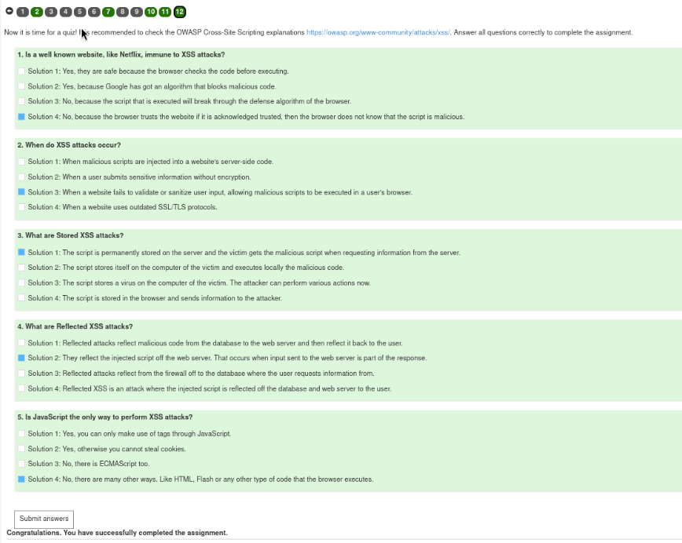

---

## 2.4. Висновки та рекомендації щодо захисту від XSS

### 💡 Висновки:
Вразливості Cross-Site Scripting залишаються однією з найголовніших загроз для фронтенду сучасних веб-додатків. Вони дозволяють зловмисникам обходити політику однакового походження (**Same-Origin Policy**), красти сесійні ідентифікатори, перехоплювати введення з клавіатури (Keylogging) та здійснювати фішингові атаки в довіреному контексті домену.

---

### 🛡️ Рекомендації щодо усунення XSS:

1. **Контекстне екранування вихідних даних (Context-Aware Output Encoding):**
   - Усі динамічні дані, що вставляються в DOM, мають обов'язково кодуватися відповідно до контексту:
     - HTML Body: `&lt;` замість `<`, `&gt;` замість `>`.
     - HTML Attribute: экранування лапок (`&quot;`, `&#x27;`).
     - JavaScript Context: Unicode-екранування (`\u0027`).
2. **Використання безпечних API роботи з DOM:**
   - Замість небезпечних `element.innerHTML`, `document.write()` або `eval()` використовувати безпечні методи `element.textContent`, `element.innerText`, `element.setAttribute()`.
3. **Санітизація HTML (Sanitization):**
   - При необхідності дозволу форматованого HTML-вводу застосовувати надійні бібліотеки санітизації (наприклад, **DOMPurify**).
4. **Політика безпеки контенту (Content Security Policy, CSP):**
   - Встановлення HTTP-заголовка `Content-Security-Policy: default-src 'self'; script-src 'self' https://trusted.cdn.com`, що блокує виконання inline-скриптів (`unsafe-inline`) та завантаження скриптів зі сторонніх неавторизованих доменів.
5. **Захисні атрибути Cookie:**
   - Обов'язкове встановлення прапорця `HttpOnly` для сесійних cookie (`JSESSIONID`, `token`), що робить неможливою їхню крадіжку через JavaScript-код `document.cookie`.

---
<div align="center">
  <sub>Звіт підготовлено в рамках навчального курсу з веб-безпеки • 2026</sub>
</div>
